#  

##  취향으로 채우는 나만의 팔레트, PaletteMe
미술에 대한 진입 장벽을 낮추고, 다양한 작품을 자유롭게 감상하며 나만의 미술 취향을 찾아가는 서비스

### 🧭 서비스 목적
---
🎨 **누구나 쉽게, 부담 없이 미술 감상**  
> 미술에 대한 배경 지식 없이도 편하게 작품을 감상할 수 있는 환경을 제공합니다.

📝 **감상문 작성으로 나만의 취향 발견**  
> 감상 기록을 통해 자신의 취향을 발견하고, 다른 사용자와 감상을 공유할 수 있습니다.

🤖 **사용자 맞춤형 추천**  
> 사용자 데이터 기반 분석을 통해, 개인 맞춤형 작품 추천 경험을 제공합니다.

🖼 **100만 건 이상의 작품 데이터 탐색**  
> 방대한 미술 작품 데이터 속에서 원하는 작품을 자유롭게 찾아볼 수 있습니다.

📅 **Wrapped로 돌아보는 감상 여정**  
> 한 달간의 감상 활동을 정리해 보여주는 Wrapped 콘텐츠로, 나의 미술 여정을 시각화합니다.

## 🔔 SSAFY 12기 특화 PJT

📍 **빅데이터 분산 프로젝트**

2025.02.24 ~ 2025.04.11 (7주)

## 🎬 서비스 영상

👉🏻[PaletteMe](https://youtu.be/VFEmw9XV95g)

## ✨ 주요 기능

### 🏛️ 1. 오늘의 작품
> 하루에 한 작품씩, 엄선된 명화와 함께 작품의 배경, 작가의 의도, 감상 포인트까지 소개해 드립니다.

> "아는 만큼 보인다" – **AI 도슨트 물감이**가 모든 작품의 이야기를 쉽고 친절하게 안내합니다.
미술이 처음인 분들도 작품을 자연스럽게 이해하고 감상할 수 있도록 도와드립니다.

  
  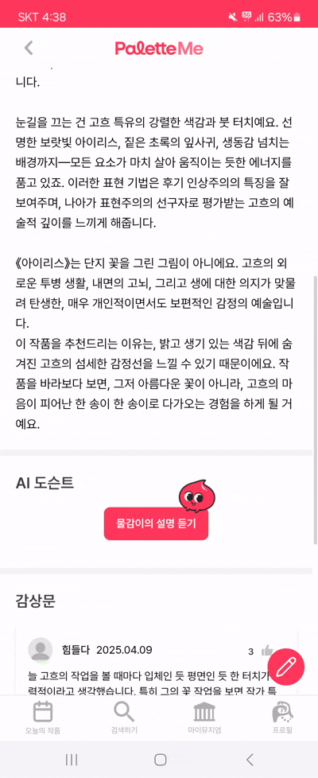

 

### ✍️ 2. 감상문
> 작품 감상 후 자유롭게 감상문을 작성하고,
이를 공유하거나 비공개로 저장해 나만의 기록을 쌓을 수 있습니다.

  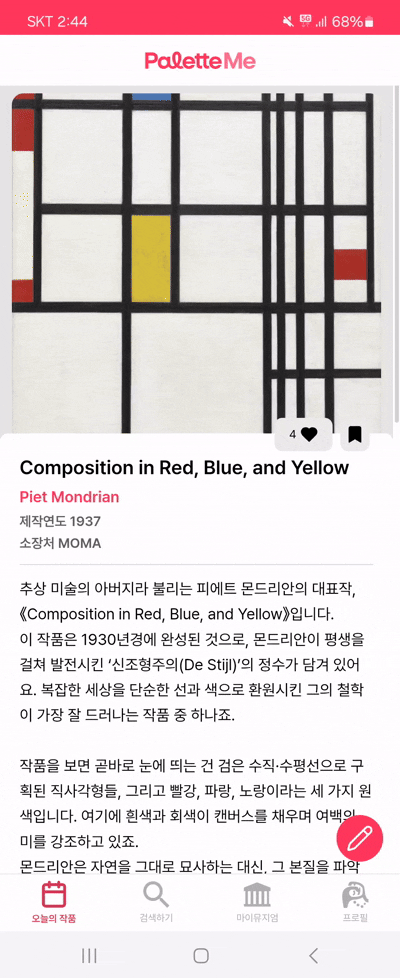
  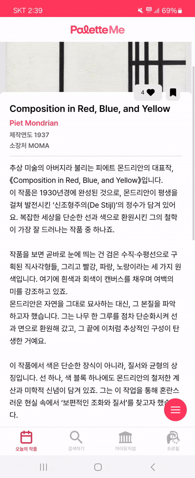

 

### 🔎 3. 검색
> 작품명 또는 화가명으로 쉽게 검색할 수 있으며, 영어와 한글 모두 지원합니다.

> 인기 작품 랭킹을 통해 최근 미술 감상 트렌드도 확인해보세요.

  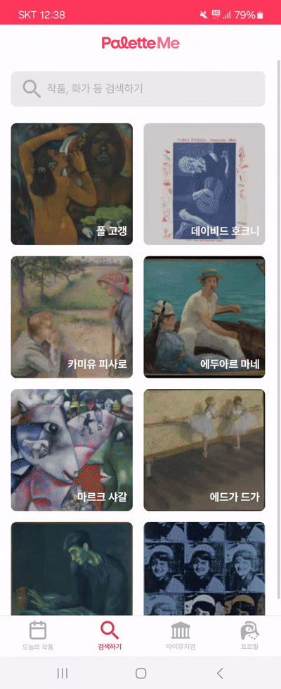
  

 

### 🎨 4. 마이 뮤지엄
> **1. 감상문 기록 일지** 
> 매일 작성하는 감상문이 나만의 팔레트를 채워줍니다.

> **2. 개인 맞춤형 추천 컬렉션** 
> 사용자의 감상 활동을 분석하여 개인 취향에 맞는 컬렉션을 추천합니다.
> - 연령대 기반 추천
> - 선호 작가 기반 추천
> - 유사한 취향의 다른 사용자들의 감상 경향
> - 선호 색상 기반 추천

  
  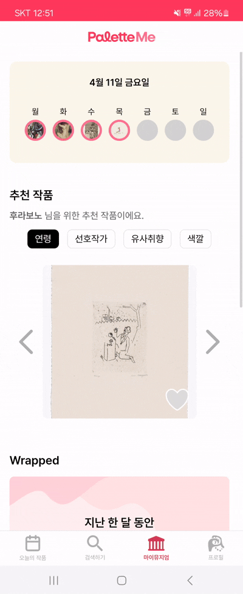

 

> **3. 월말 결산, Wrapped** 
> 한 달 동안의 감상 활동을 분석해 가장 많이 감상한 작가와 작품, 감상문 작성 순위 등을 한눈에 정리해 보여줍니다. 
나의 미술 여정을 돌아보며, 취향의 흐름과 변화를 확인해보세요.

> **4. 좋아요, 북마크, 감상문 컬렉션** 
> 마음에 드는 작품은 좋아요로, 
다시 보고 싶은 작품은 북마크로, 
감동적인 감상문은 컬렉션에 담아보세요.

  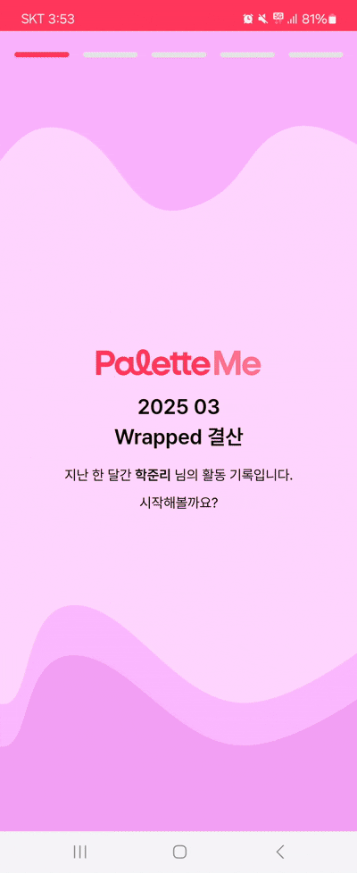
  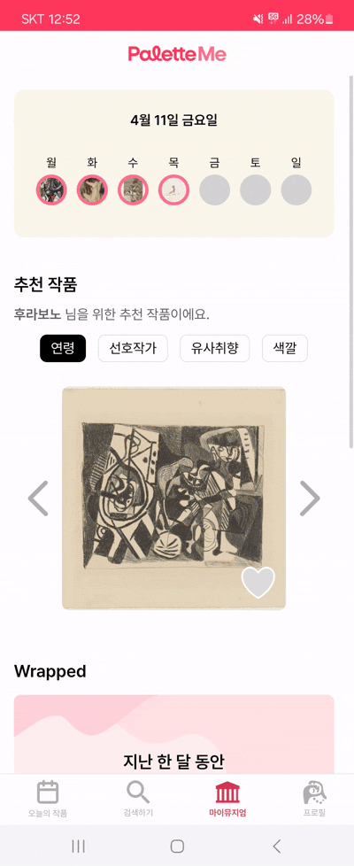

 

## 🌐 사이트

🔗 [PaletteMe](https://j12a505.p.ssafy.io/)

---

 

## ⚙️ 기술 스택

<table>
    <thead>
        <tr>
            <th>분류</th>
            <th>기술 스택</th>
        </tr>
    </thead>
    <tbody>
        <tr>
            <td>
                  
프론트엔드

            </td>
            <td>
                    
                    
                    
            </td>
        </tr>
        <tr>
            <td>
                
백엔드

            </td>
            <td>
                
                
                
            </td>
        </tr>
        <tr>
            <td>
                
데이터 처리

            </td>
            <td>
                
                
                
            </td>
        </tr>
                <tr>
            <td>
                
데이터 베이스

            </td>
            <td>

            </td>
        </tr>
                <tr>
            <td>
                
검색/로그 분석

            </td>
            <td>
            
            
             
            </td>
        </tr>
        <tr>
            <td>
                
인프라/배포

            </td>
            <td>
               

            </td>
        </tr>
    </tbody>
</table>

 

## 📜 산출물
### 📌 Architecture Diagram
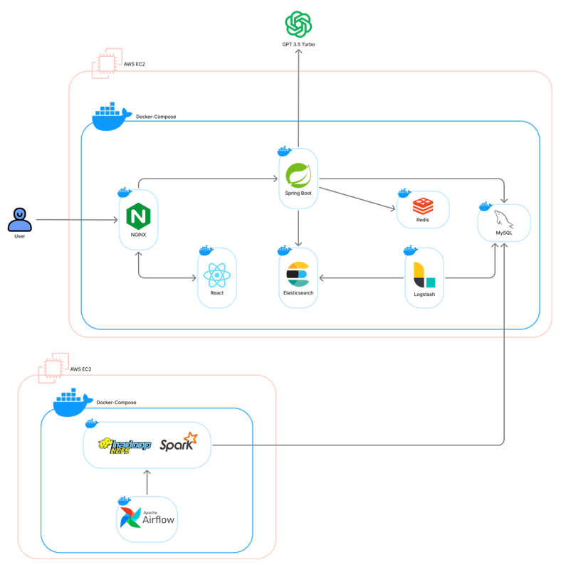
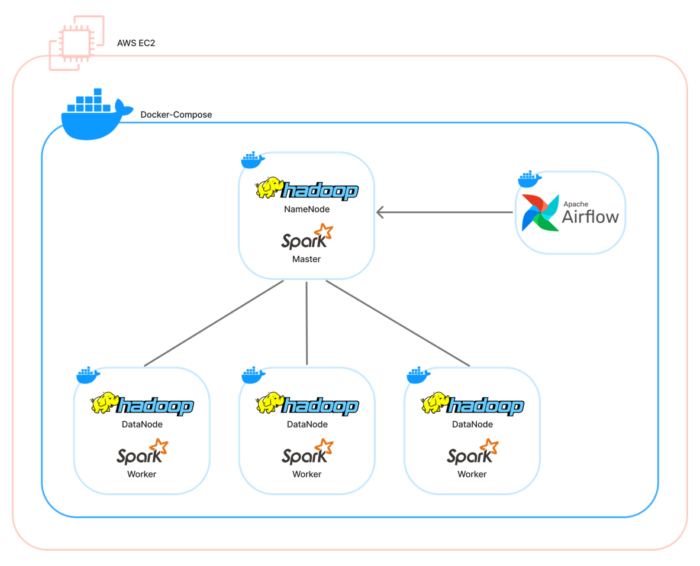
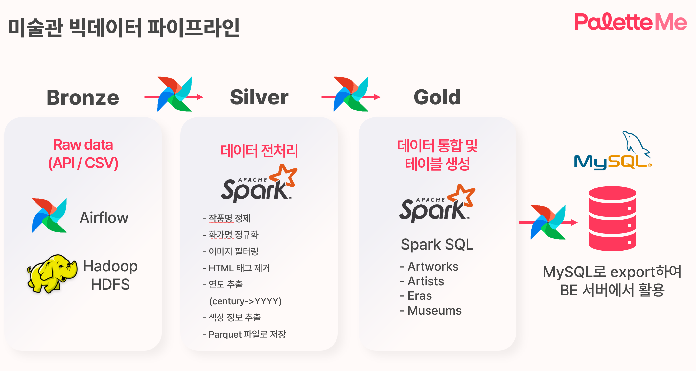

#### 🛠️ 데이터 파이프라인 및 아키텍처

- **Hadoop, Spark, Airflow**를 활용해 **5개의 미술관 데이터**를 수집  
- 수집한 데이터를 **MySQL**에 저장  
- 저장된 데이터를 **Elasticsearch**로 연동하여 **고속 검색**에 활용  
- **NGINX**가 사용자 요청을 모두 수신하고, 요청을 **React 프론트엔드** 또는 **Spring Boot 서버**로 전달

### 📌 ERD
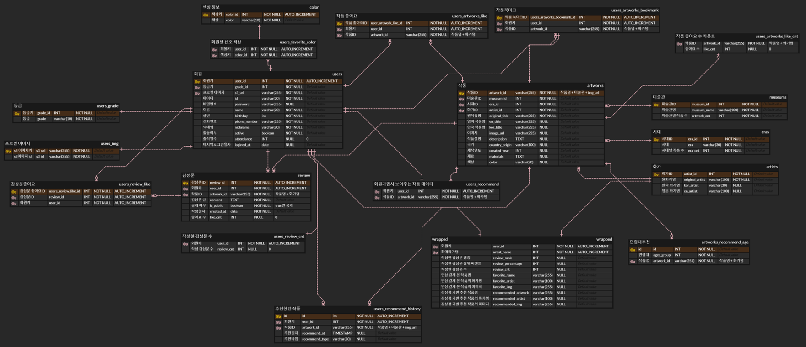
  

### 📌 User Flow
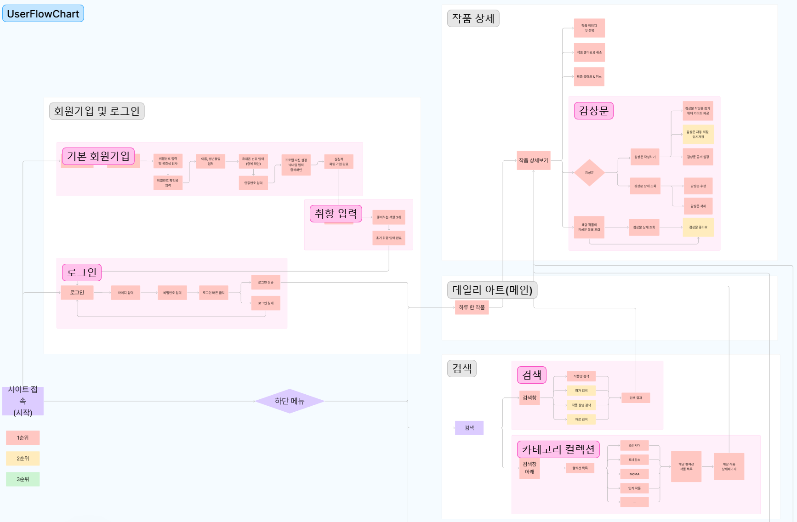
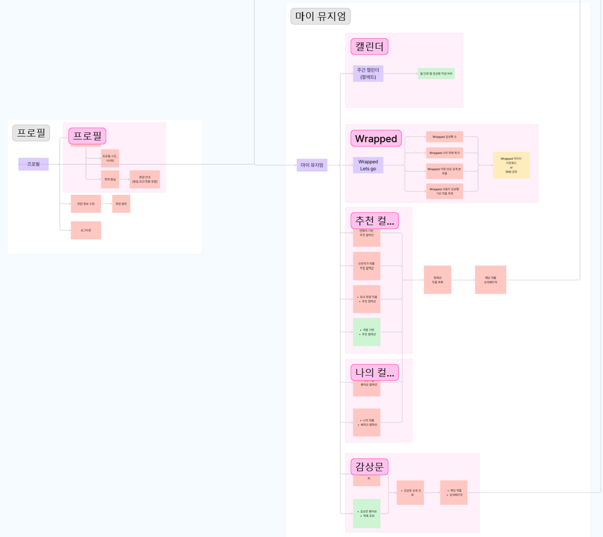
  

### 📌 Wire Frame

## 🧡 팀원 소개

<table>
    <tr>
      <th scope="col" colspan="3"> Backend </th>
      <th scope="col" colspan="3"> Frontend </th>
    </tr>
    <tr>
      <td>김윤</td>
      <td>노영단</td>
      <td>이학준</td>
      <td>강명주</td>
      <td>김지윤</td>
      <td>김현희</td>
    </tr>
    <tr>
      <td>
        
      </td>
      <td>
        
      </td>
      <td>
          
      </td>
      <td>
        
      </td>
      <td>
        
      </td>
      <td>
        
      </td> 
    </tr>
</table>

 

| Contributors | Role                   | Position |
|--------------|------------------------|----------|
| **김윤**     | 팀장,   Backend   | - **추천 및 랭킹 API 개발**   - **DB 설계**   - **빅데이터 분산 처리**   - **데이터 파이프라인 구축** |
| **노영단**   | 팀원,   Backend   | - **Elasticsearch를 활용한 검색 최적화**   - **Docker를 활용한 배포**   - **DB 설계**   - **마이뮤지엄 API 개발** |
| **이학준**   | 팀원,   Backend   | - **인증 / 인가 기능 구현**   - **DB 설계**   - **감상문 API 개발**   - **배치 처리** |
| **강명주**   | 팀원,   Frontend  | - **검색 페이지**   - **마이뮤지엄 페이지**   - **디자인 컨셉 정의**   - **UI/UX 디자인** |
| **김지윤**   | 팀원,   Frontend  | - **로그인 / 회원가입 페이지**   - **프로필 페이지**   - **UI/UX 디자인**   - **JIRA 관리** |
| **김현희**   | 팀원,   Frontend  | - **아이디어 기획 및 UserFlow 설계**   - **와이어프레임 및 UI/UX 디자인**   - **작품 / 감상문 페이지**   - **발표 자료 제작** |

