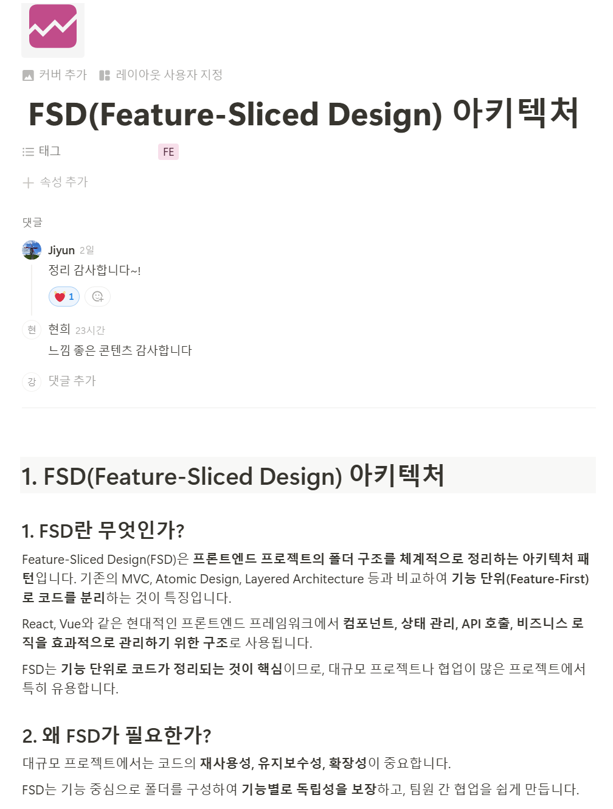
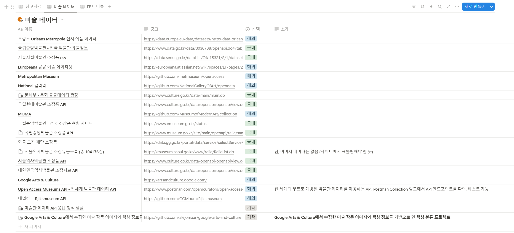
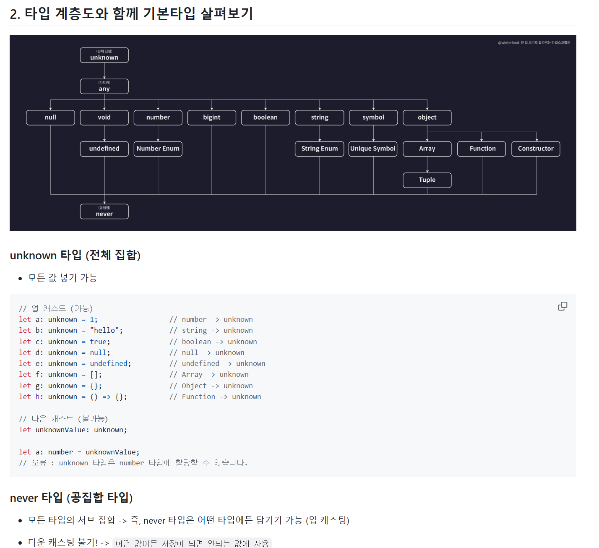

# 평가 5

- 강명주

## 1. FSD(Feature-Sliced Design) 아키텍처 아티클 공유

공통 프로젝트 때 사용한 FSD 아키텍처를 아티클로 작성하여 팀원들과 공유했습니다. FE 폴더 구조를 체계적으로 정리하는 방법인 FSD 아키텍처는 효율적으로 모듈화하는 방법입니다. 공통 때 사용해본 결과, 다른 사람들에게도 소개하면 좋겠다고 생각했습니다. FSD 구조에 대해 공부한 자료와 공통 프로젝트 구조로 예시를 들어 FED 구조를 모르는 사람도 이해할 수 있게 아티클을 작성하고자 했습니다.

[📖 Notion에서 자세히 보기](https://kimhyunhee.notion.site/FSD-Feature-Sliced-Design-1ad63f189b7e8032bd0fc573d0870d04?pvs=4)

## 2. 미술 데이터 정리

프로젝트에 사용할 미술 데이터를 정리했습니다. 미술 데이터를 활용하기 위해 팀원들과 자료조사를 했습니다. 국내외 미술 작품 데이터 CSV와 API를 찾아봤고 이를 회의를 하며 서로 공유했습니다. 공유한 자료를  한 눈에 볼 수 있게 노션에 데이터베이스를 만들었습니다.

## 3. 타입스크립트 공부

프로젝트에 사용할 타입스크립트를 공부했습니다. 공통 때는 리액트만 사용했지만, 특화 때는 리액트와 타입스크립트를 같이 사용할 계획입니다. 이를 위해 따로 개인 공부를 하고 있습니다. 강의를 수강하면서 공부를 하고 내용을 정리했습니다.

[📖 github README.md로 정리](https://github.com/notrealsilk/onebite-typescript/tree/main/section1)

