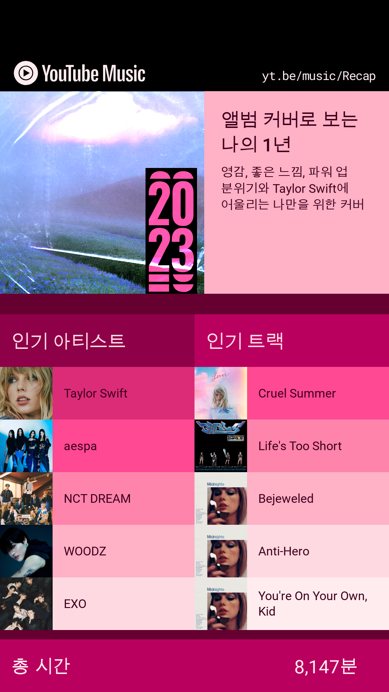
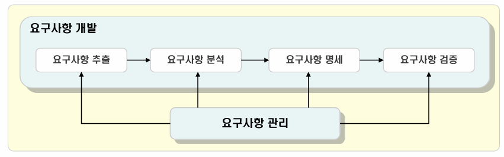

## 목차

1. [주제 브레인스토밍](#1-주제-브레인스토밍)
2. [기획안](#2-기획안)
3. [객체지향 요구사항 분석](#3-객체지향-요구사항-분석)
4. [빅데이터 플랫폼 강의 수강](#4-빅데이터-플랫폼-강의-수강)

## 1. 주제 브레인스토밍

- 250304 마인드맵
  
- 250305 팀 회의 마인드맵
  

## 2. 기획안

### 1. 주제

- 하루 한 작품으로 나의 미술 취향 찾기
  → 빅데이터 분산 처리 기술을 활용하여 국립중앙박물관, MoMA, 메트로폴리탄 미술관 등 다양한 미술 데이터셋을 통합하고, 개인 맞춤형 미술 학습 플랫폼

### 2. 목표

- 미술 지식에 대한 진입장벽을 낮추어 누구나 부담 없이 미술 작품을 즐길 수 있도록 함
- 사용자의 감상 데이터를 활용한 맞춤형 추천을 통해 미술 취향을 탐색하고, 관련 작품부 학습이 가능하도록 지원
- Wrapped 기능을 통해 개인의 감상 패턴을 시각화하여 제공하고 지속적인 감상 동기 부여
  - Wrapped
    
- 대규모 미술 데이터셋을 효율적으로 분산 처리하여 검색과 개인화 추천 성능을 높임

### 3. 배경

- 전시회를 방문하더라도 작품에 대한 지식이 부족해 깊이 있는 감상이 어려운 경우가 많음
- 듀오링고처럼 쉽고 재미있게 미술을 배울 수 있는 플랫폼이 필요
- 자신의 미술 취향을 모르는 사용자들을 위한 취향 분석 및 추천 제공

### 4. 페르소나

- 미술 초보 감상자, 김ㅇㅇ(여, 27세)
  - 미술 전시회를 보는 걸 좋아하지만, 작품에 대한 배경 지식이 부족해 깊이 있는 감상이 어렵다고 느낀다. 미술을 배우고 싶지만 어디서부터 시작해야 할지 몰라 망설이고, 전문적인 용어나 방대한 정보에 부담을 느낀다. 하지만 자신의 미술 취향을 알고 싶고, 좋아하는 작품, 시대, 작가를 발견하며 자연스럽게 공부해보고 싶다. 하루 한 작품씩 부담 없이 감상하고, 감상문을 남기면서 차근차근 미술을 배워나가는 경험을 원한다.

### 5. 주요 기능

- 매일 한 작품 감상
  - 세계 명화를 매일 한 작품씩 추천하고 해설 제공
  - 사용자가 매일 작품을 감상하여 미술 지식을 쌓을 수 있도록 함
- 취향 기반 개인 맞춤 추천
  - Hadoop과 Spark 기반의 분산 데이터 처리 및 추천 알고리즘 적용
  - 사용자의 감상 기록(좋아요, 감상문 키워드, 감상 시간 등)을 분석하여 맞춤형 작품 추천
  - 선호하는 작가, 테마, 색감 등을 반영한 큐레이션
- 감상문 작성 및 Streak 기능
  - 감상문을 작성하면 자동으로 개인 노트에 저장
  - Streak 보상 시스템을 적용하여 감상문 작성 유도
- 시대, 작가, 테마별 컬렉션 제공
  - 특정 작가, 시대, 테마 별로 작품을 감상할 수 있는 컬렉션 제공
  - 사용자의 감상 이력을 반영하여 맞춤형 컬렉션 추천
- 검색 기능
  - 작품 및 작가 검색 가능
  - 검색 결과에 관련 작품, 비슷한 스타일의 작품 추천 기능 포함
- 분기별 Wrapped 콘텐츠 제공
  - 사용자의 감상 활동을 분석하여 시각적으로 제공
    - 선호하는 작가, 색감, 시대 분석
    - 감상 시간, 감상문 키워드 분석을 통한 취향 리포트
  - 이미지로 저장할 수 있게 하여 sns 공유 가능

### 6. 기대효과

- 미술 감상의 진입장벽을 낮추고, 누구나 쉽게 미술을 접할 수 있도록 함
- 사용자의 미술 취향을 분석하고 개인 맞춤형 큐레이션 제공
- 좋아하는 작품과 연관된 작품을 추천하여 취향에 맞는 미술 작품 공부 가능
- Wrapped 기능을 통해 사용자의 미술 감상 활동을 시각적으로 분석 및 공유 가능

## 3. 객체지향 요구사항 분석

## **1. 객체지향 요구사항 분석**

객체지향(OOP) 방식으로 요구사항을 분석하면 사용자의 요구를 실제 소프트웨어 설계에 자연스럽게 반영할 수 있다.

목표는 다음과 같다.

- 사용자의 요구를 객체(클래스) 단위로 정리
- 시스템 동작을 유스케이스 기반으로 분석
- SRS(소프트웨어 요구사항 명세서) 를 작성하여 개발자가 쉽게 이해할 수 있도록 문서화

## **2. 객체지향 요구사항 분석의 전체 흐름**

1. 요구사항 수집 → 사용자 인터뷰, 설문조사 등
2. 요구사항 분석 → 기능적 요구/비기능적 요구로 정리
3. 유스케이스 다이어그램 작성 → 사용자와 시스템 간의 관계 정리
4. 유스케이스 상세 정의 → 유스케이스 시나리오 작성
5. 클래스 다이어그램 작성 → 시스템의 주요 객체 및 관계 정리
6. 시퀀스 다이어그램 작성 → 객체 간 메시지 흐름 정의
7. SRS 문서 작성 → 요구사항을 공식 문서화

## **3. 단계별 요구사항 분석 및 SRS 작성**

### **1) 요구사항 수집**

- 목적
  - 사용자가 원하는 기능을 파악
  - 시스템이 충족해야 할 조건 및 제약사항 정리
- 수집 방법
  - 인터뷰 → 사용자가 원하는 기능을 직접 묻기
  - 설문 조사 → 다수의 사용자 의견 수집
  - 경쟁사 분석 → 유사 시스템의 기능 확인
- 산출물: Raw 요구사항 목록 (줄글 형태)
- 다음 단계와의 관계
  - 이 데이터를 정리하여 기능적/비기능적 요구사항 목록으로 변환

### **2) 요구사항 분석 및 정제**

- 목적
  - 요구사항을 중복 제거, 분류, 정리하여 체계적으로 문서화
- 산출물: 요구사항 목록

| ID   | 요구사항 설명                                      | 유형   | 우선순위  |
| ---- | -------------------------------------------------- | ------ | --------- |
| FR1  | 사용자는 회원가입할 수 있어야 한다.                | 기능   | Must Have |
| FR2  | 사용자는 로그인 후 도서를 검색할 수 있어야 한다.   | 기능   | Must Have |
| FR3  | 사용자는 도서를 대여하고 반납할 수 있어야 한다.    | 기능   | Must Have |
| NFR1 | 시스템은 하루 1,000명의 동시 접속을 지원해야 한다. | 비기능 | Must Have |

- **다음 단계와의 관계**
  - 이 문서를 기반으로 유스케이스를 도출하고 다이어그램을 작성

### **3) 유스케이스 다이어그램 작성**

- 목적
  - 사용자의 목표를 기반으로 시스템이 제공해야 할 기능을 시각적으로 표현
- 유스케이스 다이어그램 예제

- 다음 단계와의 관계
  - 이 다이어그램을 기반으로 유스케이스 시나리오(상세 흐름)를 작성

### **4) 유스케이스 상세 정의**

- 목적
  - 유스케이스 다이어그램에 나타난 각 기능이 어떻게 동작하는지 상세히 정리
- 산출물: 유스케이스 시나리오

| 단계 | 사용자 행동                      | 시스템 응답                                      |
| ---- | -------------------------------- | ------------------------------------------------ |
| 1    | 사용자가 로그인한다.             | 시스템이 인증을 수행한다.                        |
| 2    | 사용자가 도서를 검색한다.        | 시스템이 검색 결과를 보여준다.                   |
| 3    | 사용자가 특정 도서를 선택한다.   | 시스템이 대여 가능 여부를 확인한다.              |
| 4    | 사용자가 "대여" 버튼을 클릭한다. | 시스템이 대여를 처리하고 완료 메시지를 표시한다. |

- 다음 단계와의 관계
  - 유스케이스 시나리오를 기반으로 클래스 다이어그램 작성

### **5) 클래스 다이어그램 작성**

- 목적
  - 시스템의 객체(클래스)와 관계를 정의하여 설계를 돕기
- 산출물: 클래스 다이어그램

- 다음 단계와의 관계
  - 이 모델을 기반으로 객체 간의 상호작용(시퀀스 다이어그램)을 정의

### **6) 시퀀스 다이어그램 작성**

- 목적
  - 객체 간 메시지 흐름을 정의하여 동작 방식 시각화
- 산출물: 시퀀스 다이어그램

- 다음 단계와의 관계
  - 이 다이어그램을 기반으로 SRS 문서를 최종 작성

### **7) SRS 문서 작성**

- 목적
  - 프로젝트의 공식 문서로 모든 요구사항을 정리하여 개발, 설계, 테스트에 활용
- 산출물: SRS 문서

## 4. 빅데이터 플랫폼 강의 수강

[빅데이터 플랫폼](https://www.notion.so/1a763f189b7e80928430fbcfc4086251?pvs=21)
