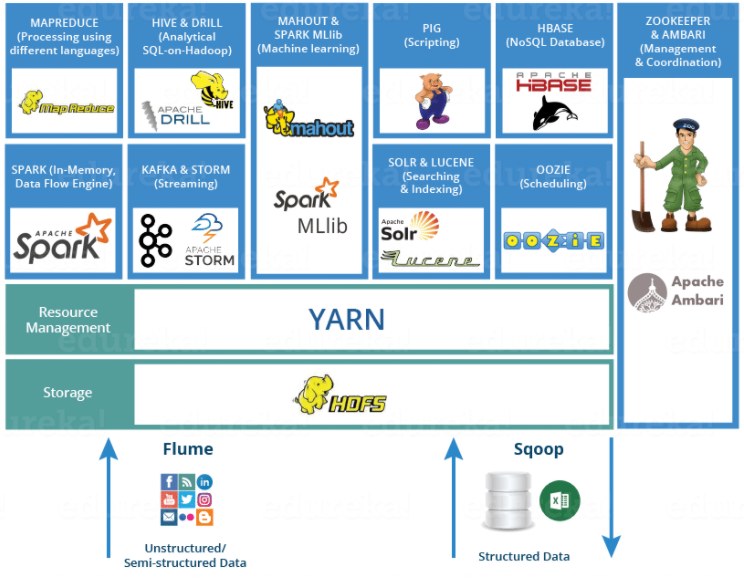
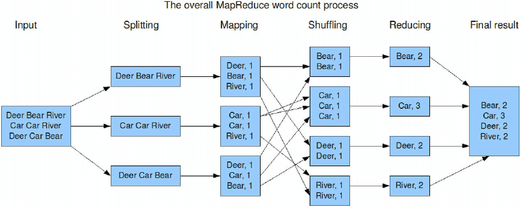

# 공부한 내용 및 한 일

- hadoop, hdfs, mapreduce에 대하여 공부 및 실습
- 특화 프로젝트 아이디어 도출

<br/>
<br/>

# Hadoop에 대하여



## Hadoop이란?

하나의 성능 좋은 컴퓨터를 이용하여 데이터를 처리하는 대신 적당한 성능의 컴퓨터 여러 대를 클러스터화하고 큰 크기의 데이터를 클러스터에서 병렬로 동시에 처리하여 처리 속도를 높이는 것을 목적으로 하는 분산처리를 위한 오픈소스 프레임워크

- 단일 서버에서 수천 대의 머신으로 확장할 수 있도록 설계되어 있음
- 일반적으로 하둡 분산처리시스템(HDFS)과 맵리듀스(MapReduce) 프레임워크로 시작되었으나, 여러 데이터 저장, 실행 엔진, 프로그래밍 및 데이터 처리 등 하둡 생태계 전반을 포함하는 의미로 확장되고 있음

## Hadoop = HDFS + MapReduce

### HDFS란?

HDFS는 ****하둡 클러스터에 연결된 여러 노드에 데이터를 분산 저장하는 파일 시스템이다.

실시간 처리보다는 대용량 데이터를 배치 처리하는 데 최적화되어 있다. 따라서 작업량이 작거나 빠른 데이터 응답이 필요한 작업에서는 적합하지 않다.

### MapReduce란?

Map Reduce는 구글이 개발한 대용량 데이터 처리 모델을 기반으로 만들어진 하둡의 핵심 프레임워크이다.
이 모델은 데이터를 Map(분할 및 가공) → Reduce(집계 및 처리) 단계로 나누어 여러 노드에서 병렬로 처리할 수 있도록 설계되었다.

따라서 하둡(Hadoop)은 대량의 데이터를 저장하고 병렬로 처리할 수 있는 프레임워크이다.

즉, **HDFS(저장)와 MapReduce(처리)가 결합된 시스템**이라고 볼 수 있다.

## Hadoop의 동작 흐름



<details>
    <summary><b>동작 흐름 설명 및 예시</b></summary>

1. 대량의 데이터가 들어오면, hdfs가 데이터를 분리해서 여러 노드에 나누어 저장한다. 기본적으로 각 블록은 3개의 DataNode에 복제(Replication) 되어 저장된다.
        
    따라서 데이터를 쪼갠 후에 NameNode는 어떤 블록이 어느 DataNode에 저장되었는지 메타데이터로 관리한다.
        
    → Hadoop에서 데이터를 저장하기 전 NameNode는 각 블록을 어떤 DataNode에 저장할지 결정한다. 그 후 각 DataNode에 블록을 분산 저장한다.
    파일 내용 자체는 NameNode에 저장되지 않고, **메타데이터(위치 정보)만 저장됨**.
        
2. HDFS에 저장된 데이터를 **병렬로 분산 처리한다.**

    기본적으로는 Map 단계 → Shuffle & Sort 단계 → Reduce 단계로 구성된다.

    - Map 단계
        - 각 블록에서 Map 함수가 병렬 실행됨 (각 DataNode에서 개별적으로 실행).
        - 입력 데이터(`key, value`)를 기반으로 가공하여 중간 결과를 생성.
        - 보통 key는 데이터의 분류 기준, value는 해당 데이터의 값.
        - WordCount 예제
                
            ```
            입력: ["Hadoop is great", "Hadoop is powerful"]
            출력: ("Hadoop", 1), ("is", 1), ("great", 1), ("Hadoop", 1), ("is", 1), ("powerful", 1)
            ```
                
    - Shuffle & Sort 단계 (데이터 정렬 & 그룹화)
        - Map에서 생성된 중간 결과를 Key 기준으로 정렬하고, 같은 Key를 가진 데이터를 그룹화함.
        - 네트워크를 통해 필요한 DataNode로 데이터를 전송 (Shuffle).
        - 같은 Key를 가진 데이터를 한 곳으로 모아서 Reduce 단계에 넘김.
        - WordCount 예제
                
            ```
            정렬 전: ("Hadoop", 1), ("is", 1), ("great", 1), ("Hadoop", 1), ("is", 1), ("powerful", 1)
                
            정렬 후: (Shuffle & Sort): ("Hadoop", [1, 1]), ("is", [1, 1]), ("great", [1]), ("powerful", [1])
            ```
                
    - Reduce 단계 (최종 결과 집계)
        - 같은 Key를 가진 데이터를 합쳐서 최종 결과 생성.
        - 보통 데이터를 집계(Aggregation) 하는 역할.
        - WordCount 예제
                
            ```
            입력: ("Hadoop", [1, 1]), ("is", [1, 1]), ("great", [1]), ("powerful", [1])
            출력: ("Hadoop", 2), ("is", 2), ("great", 1), ("powerful", 1)
            ```
                
3. 최종 결과 저장 (HDFS)
Reduce 결과를 **HDFS에 저장**하거나, 후속 분석을 위해 다른 시스템(Spark, Hive 등)과 연동.
</details>

# Docker에서 Hadoop 실행해보기

## Docker에 Ubuntu 설치하고 실행하기

docker pull ubuntu:20.04

docker run -dit --name ubuntu-container ubuntu:20.04

docker exec -it ubuntu-container bash

## hadoop 사용자 및 그룹 생성

groupadd hadoop
useradd -m -g hadoop hadoop

## 소유권 변경

chown -R hadoop:hadoop Project

## sudo 설치

apt update && apt install -y sudo

## hadoop 사용자가 비번 입력 없이 sudo를 사용할 수 있도록

echo "hadoop ALL=(ALL) NOPASSWD:ALL" >> /etc/sudoers

## ssh 설치

sudo apt update && sudo apt install -y openssh-server

## Hadoop 설치

1. hadoop(home/hadoop) 계정으로 진행. bash 명령어를 실행해 bash 환경에서 수행한다.
2. wget http://kdd.snu.ac.kr/~kddlab/Project.tar.gz
3. tar zxf Project.tar.gz
4. sudo chown -R hadoop:hadoop Project
5. cd Project
6. sudo mv hadoop-3.2.2 /usr/local/hadoop
7. sudo apt update
8. sudo apt install ssh openjdk-8-jdk ant -y
9. ./set_hadoop_env.sh
10. source ~/.bashrc

## Hadoop 실행을 위한 준비 ssh

1. home/hadoop 경로에서 수행
2. ssh-keygen -t rsa -P ""
    - 저장할 파일을 물어보면 default로 enter만 친다
3. cat $HOME/.ssh/id_rsa.pub >> $HOME/.ssh/authorized_keys
4. 제대로 생성되었는지 확인
    - ssh localhost
    - 질문이 뜨면 yes를 입력
    - 그 다음 비밀번호를 물어보지 않고 prompt가 뜨면 성공
5. [추가] ssh가 실행이 잘 안 된다면
    - sudo service ssh start 로 실행한다.

## Hadoop 실행을 위한 준비2

1. 모든 명령은 hadoop 계정에서!
    - home/hadoop 경로에서 수행
2. Name node format
    - Disk format과 같은 개념
    - hadoop namenode -format
3. DFS daemon start
    - [start-dfs.sh](http://start-dfs.sh/)
4. MapReduce daemon start (standalone 모드에서는 불필요)
    - [start-mapred.sh](http://start-mapred.sh/)
5. 확인
    - 수행중인 java 프로세서 리스트를 확인한다.
    - jps
    5637 SecondaryNameNode
    6554 Jps
    5434 DataNode
    5279 NameNode
6. HDFS 상에서 가장 상위 계층에 디렉토리를 생성
    - hdfs dfs -mkdir /user
    - hdfs dfs -mkdir /user/hadoop

## Word Count MapReduce 예제 코드 실행

1. cd /home/hadoop/Project/src
2. Driver.java 파일 수정
    - pgd.addClass("wordcount", Wordcount.class, "A map/reduce program that performs word counting.");
    - src 디렉토리에 새로운 코드를 만들때마다 src 디렉토리에 있는 Driver.java 파일에 pgd.addClass를 새로 하나 넣어 주어야 함
    - 이 경우에는 "wordcount"라는 이름으로 수행시켜야 함
    - Driver.java 파일이 바뀌면 반드시 ant를 다시 수행해야 한다.
    - hadoop jar ssafy.jar wordcount wordcount_test wordcount_test_out

### 테스트 데이터를 HDFS에 넣어야 함!!!

1. cd cd /home/hadoop/Project/
2. hdfs dfs -mkdir wordcount_test
3. hdfs dfs -put data/wordcount-data.txt wordcount_test
    - Linux의 data 디렉토리에 있는 wordcount-data.txt 파일을 하둡의 HDFS의 wordcount_test 디렉토리에 보냄
4. 반드시 맵리듀스 프로그램이 결과를 저장한 디렉토리를 삭제한 후 프로그램을 실행해야 함
    - hdfs dfs -rm -r wordcount_test_out
5. Hadoop의 실행 방법
    - Project 디렉토리 -> ant를 수행해 컴파일을 한다.
    - hadoop jar [jar file] [program name] <input arguments ... >
    - ex) hadoop jar ssafy.jar wordcount wordcount_test wordcount_test_out

## 결과 확인! (reducer 개수를 2개 사용하면 아래와 같은 출력 파일 2개가 생성됨)

1. hdfs dfs -cat wordcount_test_out/part-r-00000 | more
2. hdfs dfs -cat wordcount_test_out/part-r-00001 | more

## MatrixAdd 실행

1. Project 디렉토리에서 실행
2. ant
3. hdfs dfs -mkdir matadd_test
4. hdfs dfs -put data/matadd-data-2x2.txt matadd_test
5. hadoop jar ssafy.jar matadd matadd_test matadd_test_out
6. hdfs dfs -cat matadd_test_out/part-r-00000 | more
7. hdfs dfs -cat matadd_test_out/part-r-00001 | more

## 내 로컬에 java파일이나 결과물을 다운하려면..

hdfs dfs -get wordcount_test_out/part-r-00000 ~/Project/
docker cp 0e9bb60e8b21:/home/hadoop/Project/part-r-00000 C:\Users\SSAFY\Downloads\

<br/>
<br/>

# 특화 프로젝트 아이디어 도출
## 백준 문제 추천 및 성장 시각화 서비스

- 백준 데이터 크롤링 API를 개발자가 만들어 놓은게 있다는 듯(공식은 아님;;)
- **백준 크롤링 관련 API 정보**
        
    https://naturecancoding.tistory.com/97
        
- **유사 서비스(네이버 부트캠프에서 교육생이 개발한 듯? 지금은 서비스 No)**

    이걸 좀 더 디벨롭하면 어떨까..?
        
    https://github.com/boostcampaitech3/final-project-level3-recsys-14
        
    <details>
        <summary><b>solved.ac API 예시</b></summary>

    ```json
    [
        {
        "problemId": 1000,
        "titleKo": "A+B",
        "titles": [
        {
        "language": "ko",
        "languageDisplayName": "ko",
        "title": "A+B",
        "isOriginal": true
        },
        {
        "language": "en",
        "languageDisplayName": "en",
        "title": "A+B",
        "isOriginal": true
        }
        ],
        "isSolvable": true,
        "isPartial": false,
        "acceptedUserCount": 329152,
        "level": 1,
        "votedUserCount": 429,
        "sprout": true,
        "givesNoRating": false,
        "isLevelLocked": true,
        "averageTries": 2.5918,
        "official": true,
        "tags": [
        {
        "key": "implementation",
        "isMeta": false,
        "bojTagId": 102,
        "problemCount": 6060,
        "displayNames": [
        {
        "language": "ko",
        "name": "구현",
        "short": "구현"
        },
        {
        "language": "en",
        "name": "implementation",
        "short": "impl"
        },
        {
        "language": "ja",
        "name": "実装",
        "short": "impl"
        }
        ],
        "aliases": []
        },
        {
        "key": "arithmetic",
        "isMeta": false,
        "bojTagId": 121,
        "problemCount": 1206,
        "displayNames": [
        {
        "language": "ko",
        "name": "사칙연산",
        "short": "사칙연산"
        },
        {
        "language": "en",
        "name": "arithmetic",
        "short": "arithmetic"
        },
        {
        "language": "ja",
        "name": "算数",
        "short": "算数"
        }
        ],
        "aliases": [
        {
        "alias": "덧셈"
        },
        {
        "alias": "뺄셈"
        },
        {
        "alias": "곱셈"
        },
        {
        "alias": "나눗셈"
        },
        {
        "alias": "더하기"
        },
        {
        "alias": "빼기"
        },
        {
        "alias": "곱하기"
        },
        {
        "alias": "나누기"
        }
        ]
        },
        {
        "key": "math",
        "isMeta": false,
        "bojTagId": 124,
        "problemCount": 7107,
        "displayNames": [
        {
        "language": "ko",
        "name": "수학",
        "short": "수학"
        },
        {
        "language": "en",
        "name": "mathematics",
        "short": "math"
        },
        {
        "language": "ja",
        "name": "数学",
        "short": "数学"
        }
        ],
        "aliases": []
        }
        ],
        "metadata": {}
        }
    ]
    ```
    </details>
        
    
### 1. 주제
    
- 백준 온라인 저지(BOJ) 데이터를 활용한 문제 난이도 분석 및 추천 시스템 개발
- 문제 풀이 시간 분석을 통한 실력 성장 시각화 시스템 구축
    
### 2. 목표
    
- 사용자의 실력 수준에 맞는 문제를 추천하여 학습 효율을 향상
- 사용자의 풀이 시간과 성장 데이터를 시각화하여 실력 발전 과정 제공
    
### 3. 기획 배경
    
- 많은 사람들이 백준을 활용해 알고리즘을 공부하지만, 난이도 조절이 어렵고 비효율적인 문제 선택이 빈번함
- 자신의 실력 향상을 객관적으로 측정할 방법이 부족함
- 데이터 기반의 문제 추천 및 성장 분석 시스템을 통해 학습 효율을 높일 필요성 존재
    
### 4. 주요 기능
    
### 4.1 문제 난이도 분석 및 추천 시스템
    
- `solved.ac` API를 활용하여 문제 난이도, 정답률, 태그 기반 분석
- 사용자의 문제 풀이 이력을 분석하여 적절한 난이도의 문제 추천
- 협업 필터링 및 AI 추천 시스템 적용
- 특정 알고리즘 유형(예: DFS, DP, 그래프 등)에 대한 맞춤형 추천 기능 제공
    
### 4.2 문제 풀이 시간 분석 및 실력 성장 시각화
    
- 사용자의 문제 풀이 시간, 정답률, 시도 횟수를 분석하여 실력 성장 곡선 제공
- 특정 알고리즘 유형별 풀이 시간 비교 및 개선 방향 제공
- 풀이 속도 향상을 위한 학습 가이드 제공
- 실력 향상 트렌드를 그래프로 시각화하여 사용자에게 피드백 제공
    
### 5. 빅데이터 활용 방안
    
### 5.1 문제 난이도 및 추천 시스템 구축
    
- `solved.ac` API를 이용하여 문제의 난이도, 정답률, 태그 데이터를 수집 및 분석
- 사용자 풀이 기록을 바탕으로 개인화된 추천 알고리즘 적용
- AI 기반의 문제 추천 시스템 개발
    
### 5.2 풀이 시간 분석 및 실력 성장 패턴 시각화
    
- 사용자의 과거 풀이 기록을 데이터로 저장
- 시계열 데이터를 활용하여 문제 풀이 속도 변화 분석
- 특정 난이도의 문제 풀이 시간이 줄어드는 패턴을 분석하여 개인화된 학습 로드맵 제공
- 시각적 대시보드를 통해 사용자가 자신의 학습 진행 상황을 쉽게 확인 가능
    
### 6. 기대 효과
    
- 사용자의 실력에 맞는 문제 추천을 통해 학습 효율 증대
- 문제 풀이 시간을 분석하여 개인별 맞춤 학습 전략 제공
- 시각화된 데이터를 통해 학습 동기 부여 및 실력 향상 추적 가능
- 장기적인 데이터 축적을 통해 백준을 활용한 효율적인 알고리즘 학습 지원
    
### 7. 시장 조사 및 차별점
    
- 기존 알고리즘 문제 풀이 플랫폼은 단순 문제 제공 및 해결 여부만 제공
- 본 프로젝트는 데이터 기반의 실력 분석 및 성장 예측 시스템을 도입하여 차별화
- AI 기반 문제 추천 시스템을 통해 기존 방식 대비 학습 효율을 극대화